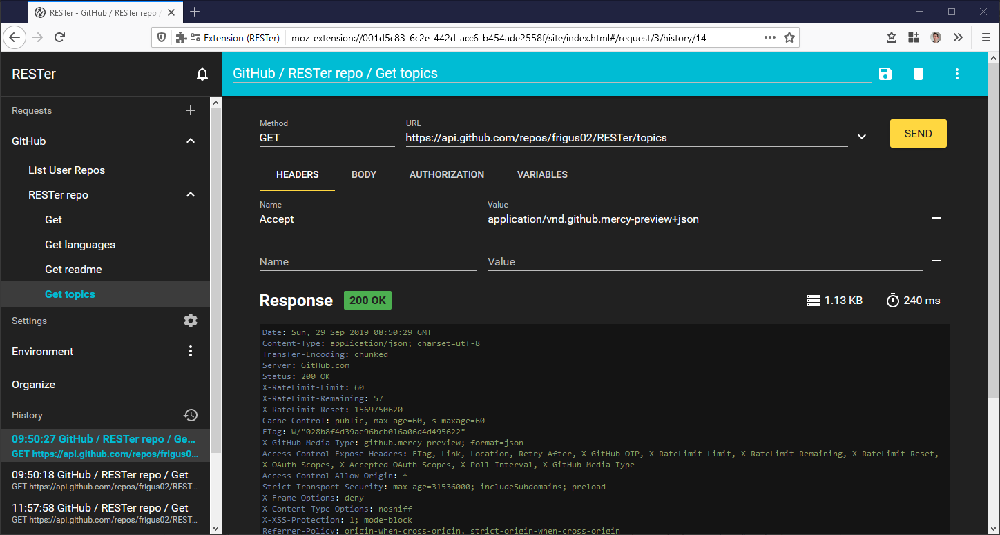

# RESTer

[](https://travis-ci.com/frigus02/RESTer)

A REST client for almost any web service.

Download for: [Firefox](https://addons.mozilla.org/firefox/addon/rester) | [Chrome](https://chrome.google.com/webstore/detail/rester/eejfoncpjfgmeleakejdcanedmefagga)



You can...

-   perform HTTP requests with any method, URL, body and custom headers.
-   save favorite requests and organize them in collections.
-   view a history of your requests, which includes the full request and response.

The add-on supports the following goodies:

-   Create and save your authorization headers with Basic, OAuth 2 or Cookie authentication.
-   Use placeholders in saved requests.
-   Use shortcuts for the frequently used actions (try pressing "?" to see the available shortcuts for the current context).

It requires a few permissions to do this. [Which permissions and why?](./docs/permissions.md)

## Develop

### Prerequisites

The project requires:

-   `node` >= 14
-   `yarn` >= 1

Install all other dependencies with the command:

```command
yarn install
```

### Run locally

To build the add-on run:

```command
yarn start
```

This will generate a working add-on in the folder _.build_. It will also watch files for changes and update the folder accordingly.

To load the add-on in the browser:

-   **Firefox**: Go to [about:debugging](about:debugging), click on "Load Temporary Add-on..." and select the file _manifest.json_ inside the _.build_ folder.
-   **Chrome**: Go to [chrome://extensions](chrome://extensions), make sure "Developer mode" is turned on, click on "Load unpacked" and select the folder _.build_.

### Package

To create packages for AMO and the Chrome Web Store run:

```command
yarn build
yarn lint
yarn test
yarn test:e2e
yarn package
```

Afterwards you will find the generated files in the folder _.package_.

## Contributors

-   [Adam Zimmerman](https://github.com/AdamZ)
-   [Ferenc Czina](https://github.com/fricci)
-   [Henning Waack](https://github.com/HenningWaack)
-   [Yusup Hambali](https://github.com/sup-ham)
